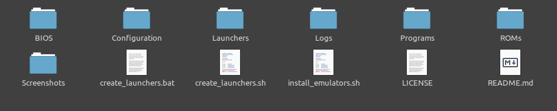
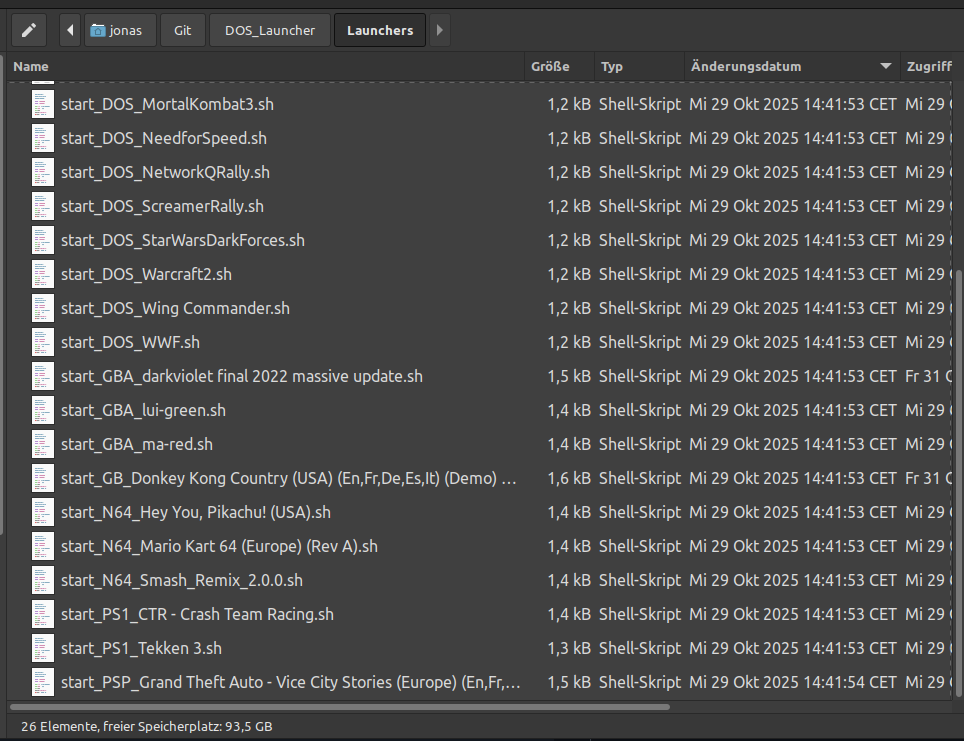

# DOS_Launcher

DOS_Launcher generates launchers for DOS games and console ROMs so they can be started from a single `.sh` or `.bat` file. The project now supports Linux, macOS, and Windows with platform-specific emulator discovery and installers.




## Features

- DOS launcher generation with per-game `dosbox.conf` overrides
- ROM launcher generation for GB, GBA, PS1, PS2, PSP, and N64
- Linux/macOS shell launchers that detect native binaries, macOS app bundles, and Linux Flatpaks when needed
- Windows batch launchers backed by PowerShell and the `Configuration/Emulators` folder layout
- Session logging for every generated launcher in `Logs/`

## Platform Setup

### Debian/Ubuntu

```bash
./install_emulators.sh
```

This installer configures:

- `dosbox`
- `mgba-qt`
- `mupen64plus` runtime packages and plugins
- Flatpak + Flathub
- DuckStation, PCSX2, and PPSSPP via Flatpak

### Fedora

```bash
./install_emulators_fedora.sh
```

This installs the Fedora package equivalents plus the same Flatpak applications used on Debian/Ubuntu.

### macOS

```bash
./install_emulators_macos.sh
```

This installer uses Homebrew to install DOSBox, mGBA, Mupen64Plus, and the DuckStation, PCSX2, and PPSSPP casks when available.

Full guide: [MACOS_SETUP.md](MACOS_SETUP.md)

### Windows

Windows uses manually installed emulator folders under `Configuration/Emulators`.

Full guide: [WINDOWS_SETUP.md](WINDOWS_SETUP.md)

The expected layout is documented in [Configuration/Emulators/README.md](Configuration/Emulators/README.md).

## Quick Start

1. Install emulators for your platform.
2. Put DOS games in `Programs/<GameName>/`.
3. Put ROMs in `ROMs/GB`, `ROMs/GBA`, `ROMs/PS1`, `ROMs/PS2`, `ROMs/PSP`, and `ROMs/N64`.
4. Add BIOS files to `BIOS/` when required. See [BIOS/README.md](BIOS/README.md).
5. Generate launchers:

```bash
./create_launchers.sh
```

On Windows:

```bat
create_launchers.bat
```

Generated launchers go to `Launchers/` by default.

## Launcher Generation

### Linux and macOS

```bash
./create_launchers.sh [OPTIONS]

Options:
  -o, --output DIR    Output directory for launcher scripts
  -h, --help          Show help
```

Example:

```bash
./create_launchers.sh -o ~/Desktop/Launchers
```

### Windows

```bat
create_launchers.bat
create_launchers.bat -OutputDir C:\Games\Launchers
```

The Windows generator emits `.bat` wrappers that call the shared PowerShell runtime in `Configuration/launch_windows.ps1`.

## Folder Layout

```text
DOS_Launcher/
├── BIOS/                         # BIOS files such as scph1001.bin
├── Configuration/
│   ├── Emulators/               # Windows emulator folders
│   │   ├── DOSBox/
│   │   ├── DuckStation/
│   │   ├── mGBA/
│   │   ├── Mupen64Plus/
│   │   ├── PCSX2/
│   │   └── PPSSPP/
│   ├── dosbox.conf              # Shared DOSBox config
│   ├── launch_unix.sh           # Shared Linux/macOS launcher runtime
│   ├── launch_windows.ps1       # Shared Windows launcher runtime
│   └── mupen64plus.cfg          # Shared N64 config
├── Launchers/                   # Generated launchers
├── Logs/                        # Runtime logs
├── Programs/                    # DOS program folders
└── ROMs/                        # Console ROM folders
```

## Supported Platforms

| Platform | Default launcher type | Emulator resolution |
|----------|------------------------|---------------------|
| Debian/Ubuntu | `.sh` | Native packages, Flatpak for PS1/PS2/PSP |
| Fedora | `.sh` | Native packages, Flatpak for PS1/PS2/PSP |
| macOS | `.sh` | Homebrew binaries and app bundles |
| Windows | `.bat` | `Configuration/Emulators/*` first, then `PATH` |

## BIOS Notes

- PS1 requires a valid dumped BIOS file such as `scph1001.bin`
- PCSX2 may also require BIOS setup on first launch depending on your build
- Linux installers configure DuckStation to use the project `BIOS/` directory
- Windows and macOS guides explain the first-run BIOS flow for their platforms

## Notes

- Each DOS game folder can include its own `dosbox.conf`
- ROM launchers use full paths so spaces in file names are supported
- PS1 `.bin` files referenced by a `.cue` are skipped during launcher generation to avoid duplicate launchers
- All launchers write logs to `Logs/`
- For DOSBox shortcuts, see https://www.dosbox.com/wiki/Special_Keys
